# CamPhish v4.0

**Grab camera shots and video streams from a target's phone or PC webcam by sending a link.**

[](LICENSE)
[](https://www.docker.com/)
[](https://buildpacks.io/)
[](https://www.php.net/)
[](https://webrtc.org/)
[](https://openai.com/)

---

## Architecture Overview

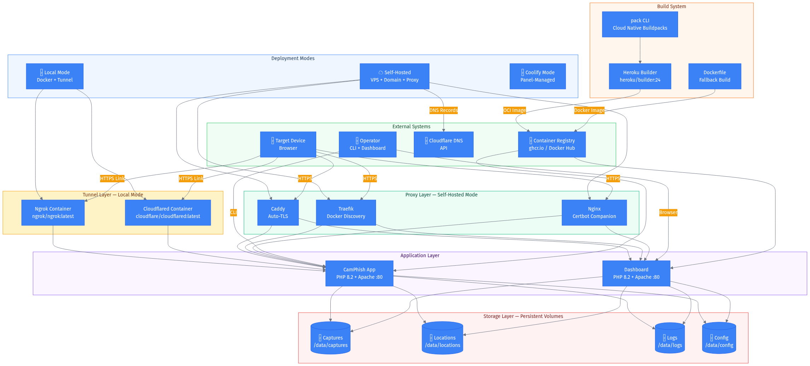

CamPhish v4.0 is a **containerized, multi-mode deployment system** built on Docker Compose with Cloud Native Buildpacks. It replaces the original single bash script with a production-grade architecture supporting three deployment modes, three reverse proxy options, two tunnel providers, and five major new capabilities.

### New in v4.0

| Feature | Description |
|---------|-------------|
| **HTTP Basic Auth** | Password-protect the dashboard with Apache htpasswd |
| **Multi-Session Management** | Operator panel for creating, switching, and deleting target sessions |
| **Capture Watermarking** | Session ID + timestamp overlay on every captured image via GD library |
| **WebRTC Streaming** | MediaRecorder-based video streaming with automatic canvas fallback |
| **AI Template Generation** | LLM-powered context-aware phishing page generation (OpenAI-compatible API) |

### Project Mind Map

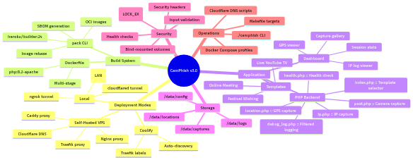

---

## Quick Start

```bash
git clone https://github.com/yashodhank/CamPhish
cd CamPhish
cp .env.example .env
# Edit .env to set TUNNEL=cloudflared (or ngrok with token)
./camphish up
```

**That's it.** You get:
- A phishing link (Cloudflare Tunnel or ngrok URL)
- A dashboard at `http://localhost:8080` to view captures, GPS locations, IP logs, and WebRTC streams
- An operator panel at `http://localhost:8080/operator/` for multi-session management
- AI template generator at `http://localhost:8080/ai-generator/` (requires API key)

### Dashboard Authentication

```bash
# Enable password protection
./camphish auth enable
# Enter username and password when prompted

# Or via Makefile
make auth-enable
```

Set `DASHBOARD_USER` and `DASHBOARD_PASS` in `.env` for automatic auth on startup.

---

## Deployment Modes

| Mode | Use Case | Command |
|------|----------|---------|
| **Local** | Laptop/desktop with tunnel | `DEPLOY_MODE=local ./camphish up` |
| **Self-Hosted** | VPS with custom domain + TLS | `DEPLOY_MODE=self-hosted ./camphish up` |
| **Coolify** | Coolify panel auto-discovery | `DEPLOY_MODE=coolify ./camphish up` |

### Deployment Decision Tree

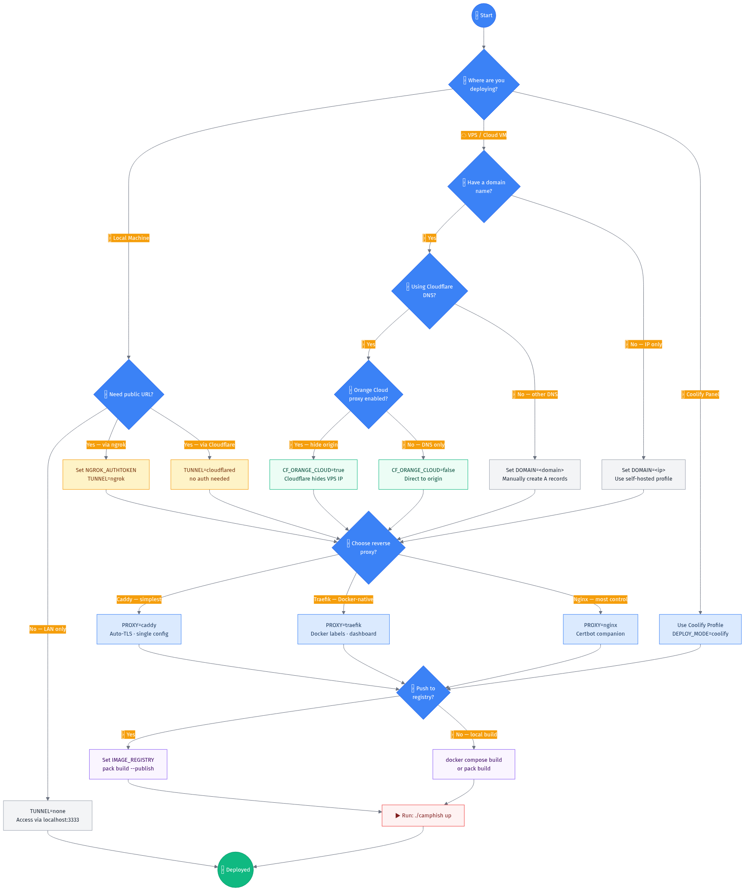

---

## Network Topology

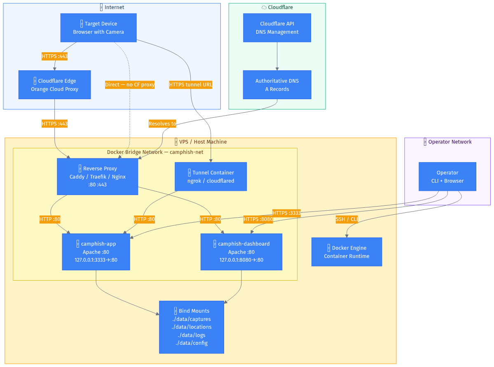

### How a Target Visit Works

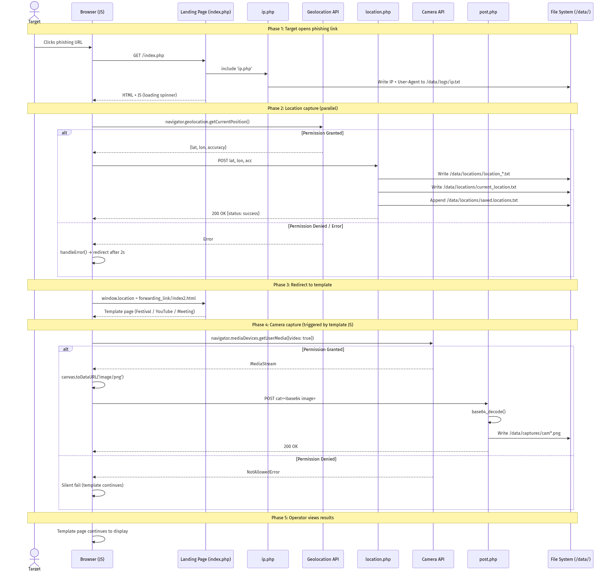

1. Target clicks the phishing link
2. Landing page loads → IP + User-Agent logged
3. Browser requests geolocation → GPS coordinates saved
4. Redirect to template (Festival / YouTube / Meeting)
5. Template requests camera permission → periodic snapshots captured
6. All data viewable in real-time on the dashboard

### Target Interaction State Machine

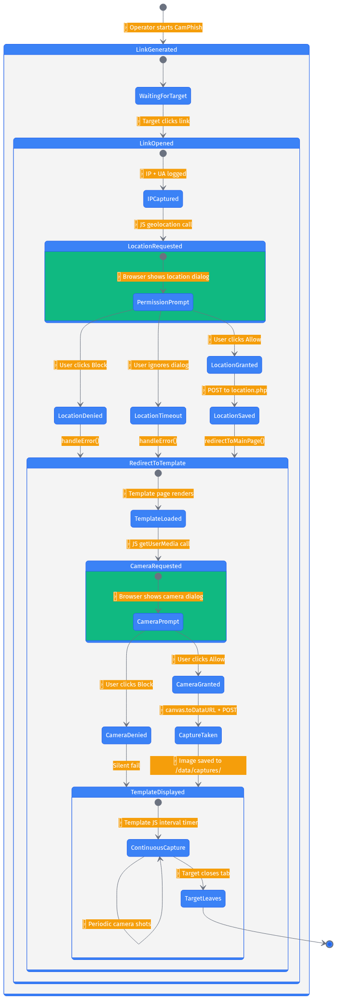

---

## Data Model

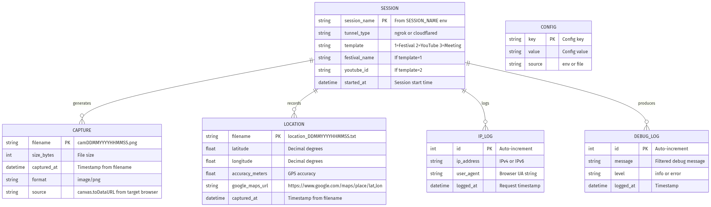

All captured data is stored in persistent Docker volumes under `./data/`:

| Directory | Contents |
|-----------|----------|
| `data/captures/` | PNG snapshots + WebRTC `.webm` stream recordings (`session_cam*.png`, `session_stream_*.webm`) |
| `data/locations/` | GPS data files with Google Maps links |
| `data/logs/` | IP logs, debug logs, session markers |
| `data/config/` | Runtime configuration (`session.env`, `sessions.json`, `.htpasswd`) |
| `data/templates/ai-generated/` | AI-generated template HTML + metadata |

---

## Build System

CamPhish supports **two build paths**:

### Path A: Cloud Native Buildpacks (pack CLI)

```bash
./camphish build        # Build OCI image with heroku/builder:24
./camphish build-all    # Build app + dashboard
./camphish inspect      # Inspect image layers
./camphish rebase       # Rebase on updated run image
./camphish sbom         # Download Software Bill of Materials
```

Uses `heroku/builder:24` which provides PHP 8.5, Apache 2.4, and Composer. The build process is fully automated — no Dockerfile needed.

### Path B: Dockerfile (fallback)

```bash
docker compose build app
docker compose build dashboard
```

Traditional Dockerfile build for environments where pack CLI is unavailable.

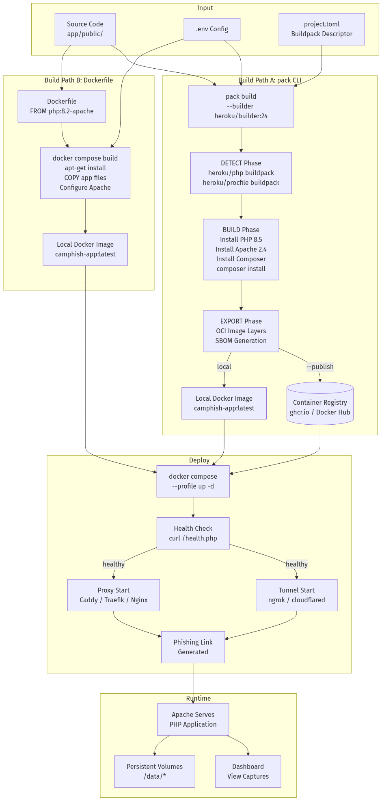

---

## Reverse Proxy Options (Self-Hosted Mode)

| Proxy | Profile | Key Feature |
|-------|---------|-------------|
| **Caddy** | `proxy-caddy` | Auto-TLS via Let's Encrypt, single Caddyfile |
| **Traefik** | `proxy-traefik` | Docker-native discovery, Cloudflare DNS-01 challenge |
| **Nginx** | `proxy-nginx` | certbot companion, fine-grained control |

Switch proxy: `make proxy-caddy` / `make proxy-traefik` / `make proxy-nginx`

---

## Cloudflare DNS Integration

```bash
make cf-dns         # Create/update A records for main + dashboard subdomains
make cf-dns-delete  # Remove DNS records
```

- **Orange Cloud ON** (`CF_ORANGE_CLOUD=true`): Cloudflare proxies traffic, hides origin IP
- **Orange Cloud OFF** (`CF_ORANGE_CLOUD=false`): DNS-only, direct to origin

---

## Dashboard

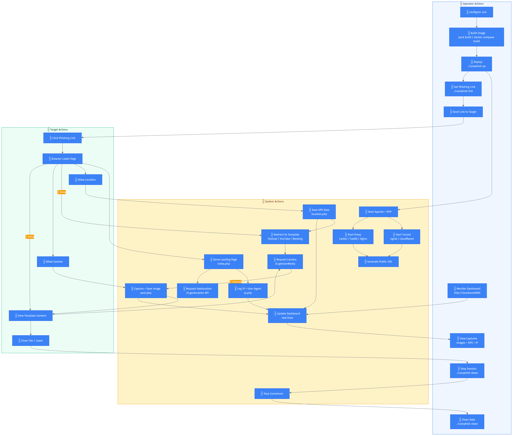

Access at `http://localhost:8080` (local) or `https://dashboard.camphish.example.com` (self-hosted).

Features:
- **Capture Gallery** — clickable thumbnails with lightbox modal
- **WebRTC Stream Player** — play recorded video streams in-browser
- **GPS Viewer** — coordinates with Google Maps links
- **IP Log** — structured IP + User-Agent records
- **Session Stats** — capture count, location count, stream count, IP log entries
- **Operator Panel** — multi-session CRUD at `/operator/`
- **AI Template Generator** — LLM-powered template creation at `/ai-generator/`

---

## CLI Reference

```
./camphish build        Build OCI image with pack
./camphish build-all    Build app + dashboard images
./camphish up           Start deployment (mode from .env)
./camphish down         Stop all services
./camphish restart      Restart all services
./camphish logs         Tail all container logs
./camphish status       Show service health
./camphish link         Show phishing URL
./camphish clean        Remove all data and volumes
./camphish inspect      Inspect built image
./camphish rebase       Rebase image on updated run image
./camphish sbom         Download SBOM
./camphish session list    List all sessions
./camphish session create  Create new session
./camphish session switch  Switch active session
./camphish session delete  Delete a session
./camphish auth enable     Enable dashboard password
./camphish auth disable    Disable dashboard password
./camphish auth status     Check auth status
```

---

## Project Structure

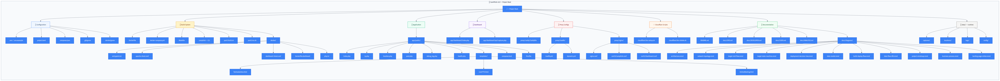

---

## Data Flow (DFD)

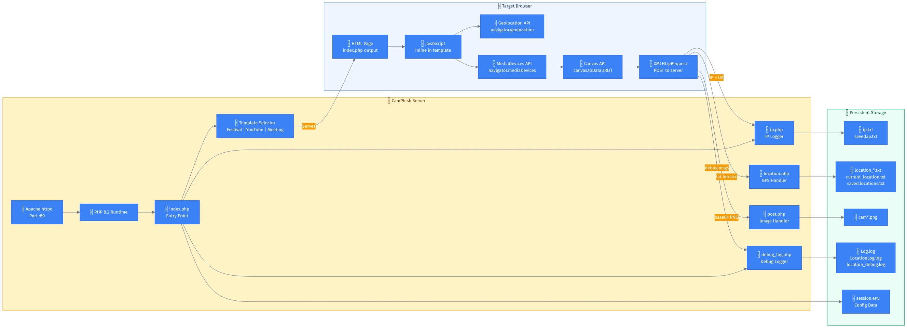

---

## Documentation

| Document | Audience |
|----------|----------|
| [README.md](README.md) | Everyone — overview and quick start |
| [docs/OPS.md](docs/OPS.md) | DevOps/SRE — deployment, monitoring, troubleshooting |
| [docs/DEVELOPER.md](docs/DEVELOPER.md) | Developers — architecture, code structure, contributing |
| [docs/USER.md](docs/USER.md) | End users — how to run, templates, dashboard |
| [docs/ANALYSIS.md](docs/ANALYSIS.md) | Technical deep-dive — security, performance, design decisions |

---

## Requirements

- **Docker** 24+ with Docker Compose v2
- **pack CLI** (optional, for buildpack builds): `brew install buildpacks/tap/pack`
- **make** (optional, for Makefile targets)
- **jq** (optional, for ngrok link extraction)

---

## Security

- All dashboard and app ports bind to `127.0.0.1` (localhost only)
- HTTP Basic Auth on dashboard (optional, via `DASHBOARD_USER`/`DASHBOARD_PASS`)
- Reverse proxies add `X-Frame-Options`, `X-Content-Type-Options` headers
- File operations use `LOCK_EX` for concurrent write safety
- Input validation on all PHP endpoints
- `.env` excluded from git via `.gitignore`
- No secrets in committed files
- Watermarking embeds session ID + timestamp on all captures

---

## License

MIT — see [LICENSE](LICENSE)

**Disclaimer:** CamPhish is created for authorized penetration testing and security research. Users are responsible for complying with all applicable laws and regulations.
